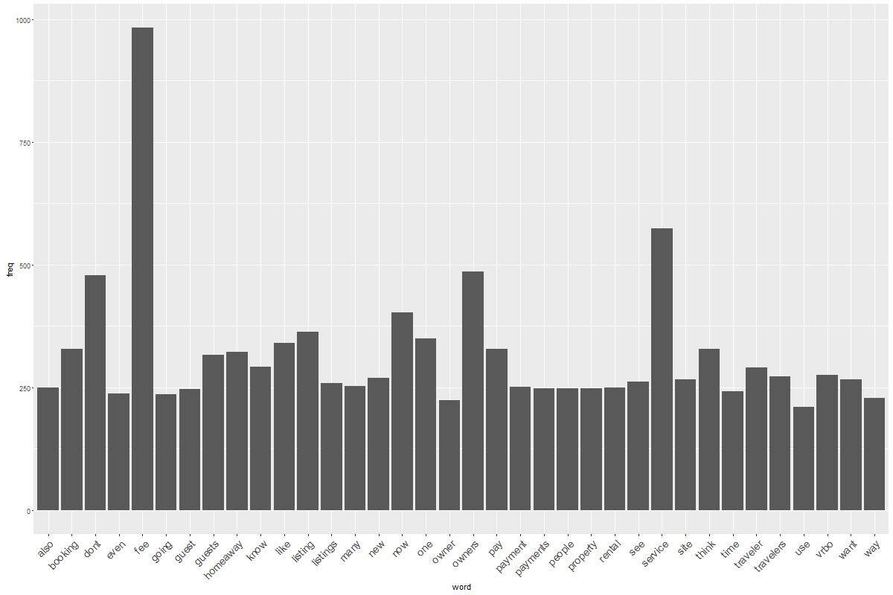
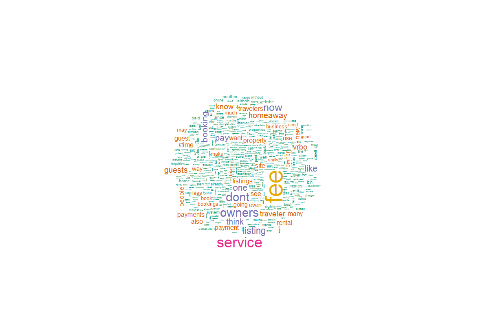
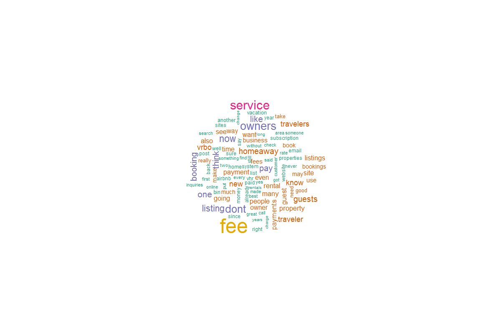
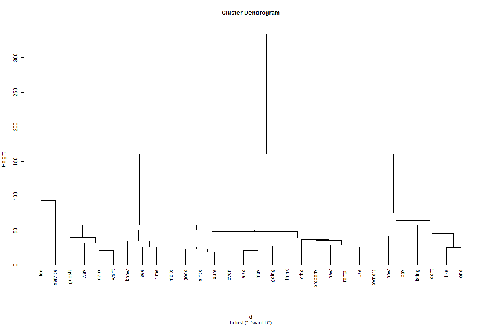
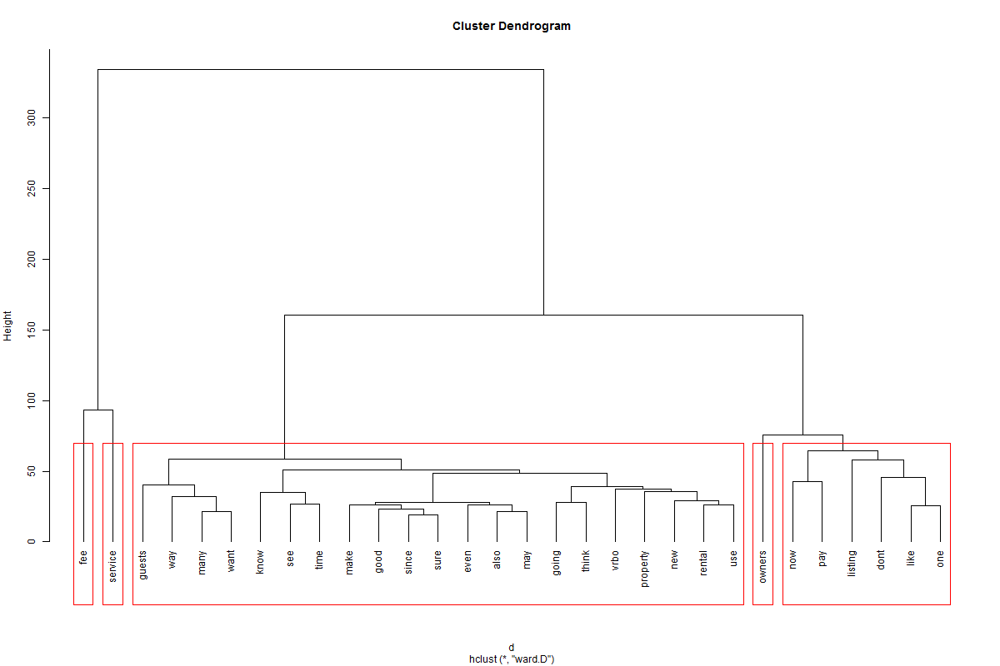
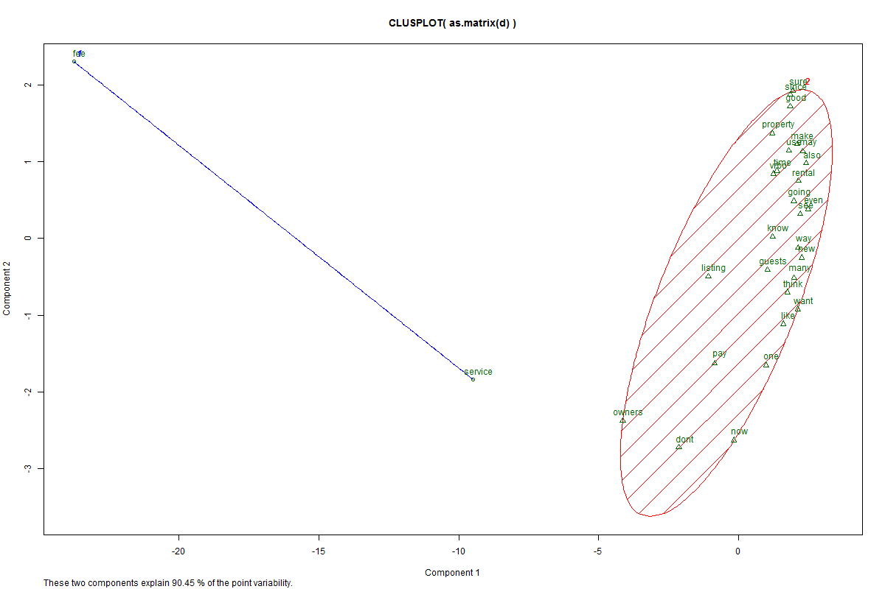

# haForum
---
output: html_document
---


#HA_Forum.Rmd
###Chad Banicki  
###February 22, 2016  

##Synopsis:
# An analysis of words found in the vacation rental owner forum discussion threads
### The purpose of this analysis is to see if any insights can be gained into how the new traveler fee might be having on overall supplier sentiment by looking for patterns in the words found within the homeaway community forum discussion threads. 

### The scope is limited to analyzing:
<ul>
  <li>Detail posted at 'https://community.homeaway.com/community/us'</li>
  <li>The first 100 Theads as of the latest website scrape date/li>
  <li>The top three pages of comments for each thread</li>
</ul>
  
## Data Processing
A web scraper (Selenium) is used to loop through URLs
found on this page that are associated with a forum thread.  

<ul>
  <li>remove puncutation</li>
  <li>remove numbers</li>
  <li>make lowercase</li>
  <li>remove stopwords</li>
  <li>remove word endings like 'ing' 'es' 's'</li>
  <li>remove specific words like "'just','get','can'</li>
  <li>strip whitespace</li>
</ul>

## Results:
Suppliers are talking about the new service fee quite a bit. The next step  might be to run the same analysis in a few weeks and see if similar patterns still appear and potentially scrape the airbnb forum for insights into word patterns that could be compared to those seen on HomeAways. In addition, similar analysis could be completed on words taken from survey results. 

For example:


SELECT *
  FROM [CEDM].[dbo].[VW_SFSurvey] sf
  JOIN [CEDM].[dbo].[VW_SFCaseAttributes] ca ON sf.SFCaseAttributesId = ca.SFCaseAttributesId
  WHERE DoneDifferent LIKE '%Service fee%'

##Instructions:
###Change the input on the function call to 1 or 2 depending on whether you want to refresh or rerun the analysis, and then hit 'Knit Html' in R studio.


```{r}   
  
    library(rvest)
    library(XML)
    library("RSelenium")
    library(stringr)
    library(tm)   
 
```


### Navigate to the forum, collect latest 100 thread links, and capture the top three pages from those threads
```{r} 
HA_Forum <- function() {
  
  
    library(rvest)
    library(XML)
    library("RSelenium")
    library(stringr)
  
  # You may have to download a driver for your browser
  
    startServer()
    mybrowser <<- remoteDriver(browserName = "chrome")
    mybrowser$open()
    
    #library(RSelenium)
#     RSelenium::startServer()
#     remDr <- remoteDriver(browserName = "phantomjs")
#     remDr$open()
  
  # --------------------------------------------------------------------------------------------------------------  
  # Not used unless you need to log in
  # --------------------------------------------------------------------------------------------------------------
  
  #     Can just log in manually first (save password) time if you want to avoid these steps
  #     #Go to the forum site
  #     mybrowser$navigate("https://community.homeaway.com/community/us")
  #     
  #     # find the login button
  #     wxbutton <- mybrowser$findElement(using = 'css selector', "#navLogin") 
  #     wxbutton$clickElement()
  #     Sys.sleep(2)
  #     
  #     # Log in to forum
  #     logbutton <- mybrowser$findElement(using = 'css selector', "#username01")
  #     logbutton$sendKeysToElement(list("SECRET"))
  #     passbutton <- mybrowser$findElement(using = 'css selector', "#password01") 
  #     passbutton$sendKeysToElement(list("SECRET2"))
  #     GoButton <- mybrowser$findElement(using = 'css selector', "#login-submit")
  #     GoButton$clickElement()
  #     
  #     #Wait for page to load
  #     Sys.sleep(2)
  
  
    
    #Go back to forum page now that you are logged in
    mybrowser$navigate("https://community.homeaway.com/community/us")
    
    
    # Base url for the forum
    url <- "https://community.homeaway.com/community/us"
    
    
   urls <- GetLinks(url)
   
   #write(urls,"urls.csv")
  urls <- sapply("https://community.homeaway.com",paste,urls,sep="")
    

    #For testing only COMMENT THIS OUT WHEN YOU WANT TO SCRAPE THE ENTIRE FORUM!!!
  # urls <- unique(grep("52823",urls, value=TRUE))    #unique(c(urls[grep("52758",url, fixed=T)],urls[grep("52481",urls, fixed=T)]))  #|52481

   
    #In case you want to output the data to a path
    path <- "threadData"
    #all <- file.path(path, "ALL") 
    
    dir.create(path, showWarnings=FALSE)
    
    download.maybe <- function(Turl) { #, refetch=TRUE, path="."
        dest <- file.path(path, basename(Turl))
         
         # if (refetch || !file.exists(dest))
          #To write each thread text to file
        
        #print(Turl)
      
       ThreadData <- if (Turl != "https://community.homeaway.com")  {
        
              HA_Scrape(Turl,dest) }
       
       return(ThreadData)
  
        #Export specific thread text to path
        #dput(ThreadText, dest)
        # print("pass")

    }

    urls <- Filter(function(x) !identical(character(0),x), urls)
    
    #print(urls)
    # The main loop that goes through each url and starts collecting the text
    files <- sapply(urls, download.maybe) # use urls for prod and subUrls for testing  #, path=path
    
     

    #Combine the files and convert them into a data frame
   #files.df <- as.data.frame(do.call(cbind, files))
    files.df <- matrix(unlist(files), ncol = 100, byrow = TRUE)
    
    #Rename the columns with the thread number
   colNames <- substr(urls, 39, 45) 
    
   colnames(files.df) <- colNames
    
  # Not currently working due to the stucture of the data  
    # write.table(files.df,"ThreadText.txt", sep="\t")
    
    # Save the data file to working directory
    #save(files.df,file="threads.RData")
    dput(files.df, "threads.txt") # took out files.df to see the output #############
    
   # print(files)
    
    #Can be used to load the data file later
    #  load("threads.Rda")
    
    #Call the formatting function
    #mineThread(files.df)
    
   # files <- files.df
    
    return(files.df)

}

```


###Loop through all of the urls and capture the text from each thread post
```{r}  

#***************************************************************************************************************

#                         Loop through and collect the latest 3 pages of Text for each thread

#**************************************************************************************************************

  HA_Scrape <- function(Burl,dest) {
    
   
        #mybrowser$navigate(Burl)
    
      #Burl <- "https://community.homeaway.com/thread/52823"

        #Look for all the links on the thread page that contain '/thread/' in the text
        ThreadUrls <- GetLinks(Burl)
        
        ThreadUrls <- sapply("https://community.homeaway.com",paste,ThreadUrls,sep="")
        
        ThreadUrls <- unique(list(ThreadUrls, list(Burl)))
        
        ThreadUrls <- ThreadUrls[ThreadUrls != "https://community.homeaway.com"]
        
        ThreadUrls <- Filter(function(x) !identical(character(0),x), ThreadUrls)
        
        ThreadUrls <- unlist(ThreadUrls)
        
        #print(ThreadUrls)
       
        
        ThreadText <- c()
        
        
        
        ThreadScrape <- function(ThreadUrls) {
          
           # ThreadDetails <- c() 
            
         mybrowser$navigate(ThreadUrls)
        
          out <- tryCatch({
         
                wxmessage <- mybrowser$findElement(using = 'css selector', "p") 
            
        
          },
              error=function(cond){
                  #message(paste("URL does not seem to exist:", ThreadUrls))
                  message("Here's the original error message:")
                  message(cond)
                  # Choose a return value in case of error
                  return(NA)},
              finally={
                       #Get the curren URL 
               HA_ThreadDtl <- read_html(wxmessage$getCurrentUrl()[[1]])
            
                #Capture the text from the comments
                ThreadDetails <- HA_ThreadDtl %>%
                  html_nodes("p") %>%
                  html_text() 
                
                return(ThreadDetails)
      
      }
      
      )
      
    }
    
    
        #Loop that captures the text from the urls
        
        #ThreadUrls <- lapply(ThreadUrls, unlist)
        ThreadText <-  sapply(ThreadUrls,ThreadScrape) #ThreadScrape(ThreadUrls) #do.call(ThreadScrape,list(ThreadUrls)) #append(ThreadText,sapply(ThreadUrls, ThreadScrape))  
      
       #write.table(ThreadText, dest, sep="\t")
        
        #}
         
      return(ThreadText)
  
    
   
  }      
```

###Sub-function used to get all the URL's on a page that contain '/thread/' in the html
```{r} 
#***************************************************************************************************************

#                           Capture the URLs
  
#**************************************************************************************************************


    GetLinks <- function(Zurl)  {
    
 
      
        mybrowser$navigate(Zurl)
        
        #Get all of the URL links from the page
        html <- paste(readLines(Zurl), collapse="\n")
        matched <- str_match_all(html, "<a href=\"(.*?)\"")
        links <- matched[[1]][, 2]
        
        #links <- list(links, Zurl)
        
       # print(links)
        
        # Get just the thread links
        TSLinks <- unique(grep("/thread/",links, value=TRUE))
        
        #print(TSLinks)
        
     
        #Append the base Url to the Thread to get the full URL
        Nurls <- sapply("https://community.homeaway.com",paste,TSLinks,sep="")
          
        #Nurls <- sapply(TSLinks,sep="")
        
        Nurls <- append(Filter(function(x) !identical(character(0),x), Nurls),c(Zurl))
        
        Nurls <- TSLinks[TSLinks != "https://community.homeaway.com"]
        
        
        Nurls <- TSLinks[TSLinks != "https://community.homeaway.com/community/us"]  
        
        Nurls <- unique(Nurls)
        
        #print(Nurls)
      
        return(Nurls)
        
    
      
    }
  
```  

### Parent script to either load existing data or run scraper to refresh data
###If Selenium is already running (and you want to stop it) paste the following into your browser: "http://localhost:4444/selenium-server/driver/?cmd=shutDownSeleniumServer"
```{r}   

HA_ForumRefresh <- function(RefreshVal) {
  
    #Prompt user to either load or refresh data
    RefreshorLoad <- RefreshVal#readline(prompt="Type 1 to load existing data or 2 to scrape new forum data: ")

    if (RefreshorLoad == 2) {
        #Strart scraping the forum website for data
        files <<- HA_Forum() 
    } else if (RefreshorLoad == 1) {
        #Load the existing data
         fileDir <- "C://Users//cbanicki//Documents//GitHub//HA_Community//HA_CommunityForum" #choose.dir()
        setwd(fileDir)
        # add trycatch here!
        #files <- load("threads.RData")
        files <<- dget("threads.txt")
    } else stop("invalid input")

     return(files)
}

```

###Process the output and generate a number of graphs and analysis 
###All of this was taken from here:
###https://rstudio-pubs-static.s3.amazonaws.com/31867_8236987cf0a8444e962ccd2aec46d9c3.html


###Process the data to remove some of the clutter
```{r}          
    
    #MakeThreads <- function() {


    files.df <- HA_ForumRefresh(1)  
    

    threads <- Corpus(VectorSource(files.df))  
       
       #summary(threads)
       
        #inspect(threads[2])
       
       #remove puncutation
       threads <- tm_map(threads, removePunctuation)  
       
          # To remove special characters
          #    for(j in seq(docs))   
          #    {   
          #      docs[[j]] <- gsub("/", " ", docs[[j]])   
          #      docs[[j]] <- gsub("@", " ", docs[[j]])   
          #      docs[[j]] <- gsub("\\|", " ", docs[[j]])   
          #    } 
       
        #remove numbers
        threads <- tm_map(threads, removeNumbers)
       
        # make lowercase
        threads <- tm_map(threads, tolower) 
       
        #remove stopwords
        threads <- tm_map(threads, removeWords, stopwords("english"))
       
        #remove specific words
        threads <- tm_map(threads, removeWords, c("will", "voir", "just","get","can","data","retrieving"))
      
        #  #combining words that should stay together
        #   for (j in seq(docs))
        #   {
        #     docs[[j]] <- gsub("qualitative research", "QDA", docs[[j]])
        #     docs[[j]] <- gsub("qualitative studies", "QDA", docs[[j]])
        #     docs[[j]] <- gsub("qualitative analysis", "QDA", docs[[j]])
        #     docs[[j]] <- gsub("research methods", "research_methods", docs[[j]])
        #   }
      

  
    #remove word endings like 'ing' 'es' 's'
      library(SnowballC)
        
      threads <- tm_map(threads, stemDocument)   
    
      #strip whitespace
      threads <- tm_map(threads, stripWhitespace)  
      
      #treat as text documents...make sure to use this   
      threads <- tm_map(threads, PlainTextDocument) 
    
      #create a document term matrix
      dtm <- DocumentTermMatrix(threads)
      
     #Save the data file to working directory
     save(threads,file="threadFormat.Rda")
     
     #return(threads)
     
    #}
```      
      

###Create a document matrix to be used for common thread terms    
```{r}      
      #create a document term matrix
      #dtm <- DocumentTermMatrix(threads)
      
       # Save the data file to working directory
       #save(dtm,file="threadtm.Rda")
      
      #transpose the matrix
      tdm <- TermDocumentMatrix(threads) 
      
      freq <- colSums(as.matrix(dtm))  
      
      #length(freq)
      
      ord <- order(freq) 
      
        #   If you prefer to export the matrix to Excel:   
        #     m <- as.matrix(dtm)   
        #   dim(m)   
        #   write.csv(m, file="dtm.csv") 
      
      #  Start by removing sparse terms:   
      dtms <- removeSparseTerms(dtm, 0.1) # This makes a matrix that is 10% empty space, maximum.   
      #inspect(dtms) 
      
      #There are a lot of terms, so for now, just check out some of the most and least frequently occurring words.
      #freq[head(ord)]  
      
      #Check out the frequency of frequencies.
      
      #head(table(freq), 20)   
      
      #tail(table(freq), 20)   
      
      #For a less, fine-grained look at term freqency we can view a table of the terms we selected when we removed sparse terms, above. (Look just       #under the word "Focus".)
      freq <- colSums(as.matrix(dtms))   
     # freq
      
      
        #The above matrix was created using a data transformation we made earlier. What follows is an alternative that will accomplish essentially         #the same thing.
        freq <- sort(colSums(as.matrix(dtm)), decreasing=TRUE)   
        # head(freq, 14) 
      
        #   An alternate view of term frequency:
        #     This will identify all terms that appear frequently (in this case, 50 or more times).
      
        findFreqTerms(dtm, lowfreq=200)   # Change "50" to whatever is most appropriate for your text data.
        #   
        #   Yet another way to do this:
        #     
        wf <- data.frame(word=names(freq), freq=freq) 
        
        
        
        # Save the data file to working directory
        #save(wf,file="threadwf.Rda")
        
        #ThreadPlot(dtm,wf)
        
     # }
   
```      
  
###Bar plot for words that appear more than 200 times    
```{r}   
      
#ThreadPlot <- function (dtm,wf) {
      #head(wf)
      
        #   Nice bar plot
        #   Plot Word Frequencies
        #   Plot words that appear at least 50 times.
  
      #png("HA_Forum_BarPlot.png", width=1200,height=800)  
    
        library(ggplot2)   
        p <- ggplot(subset(wf, freq>200), aes(word, freq))    
        p <- p + geom_bar(stat="identity")   
        p <- p + theme(axis.text.x=element_text(angle=45, hjust=1, size=14))   
        p  
    
          #   To order by bar height
          #   qplot(reorder(factor(cyl),factor(cyl),function(x) length(x)*-1),
          #         data=mtcars,geom="bar")
        
      #dev.off() 
``` 

 
 
###Display correlations between common words and other words 
```{r}  
    
      #interesting association
      #If words always appear together, then correlation=1.0.
      
      findAssocs(dtm, c("fee", "airbnb"), corlimit=0.90) # specifying a correlation limit of 0.98  
        
      #   $fee
        #    avoid expens 
        #    0.98    0.98 
        #   
        #   $airbnb
        #   advertis soon 
        #   0.99     0.99 
   
      #findAssocs(dtms, "contrast", corlimit=0.90) # specifying a correlation limit of 0.95   
```       


###Word cloud of thread words appearing at least 25 times
```{r}  
      # Wordcloud at least 25 times
      
      png("HA_Forum_WordCloud25.png", width=1200,height=800)
      
      library(wordcloud) 
      set.seed(142)   
      wordcloud(names(freq), freq, min.freq=25, scale=c(5, .1), colors=brewer.pal(6, "Dark2")) 
      
      dev.off() 
      
```      
 
 
###Word cloud of top 100 thread words
```{r} 
      
     png("HA_Forum_WordCloud100.png", width=1200,height=800)
      
     #Plot the 100 most frequently occuring words.
      
      set.seed(142)   
      dark2 <- brewer.pal(6, "Dark2")   
      wordcloud(names(freq), freq, max.words=100, rot.per=0.2, colors=dark2) 
      
     dev.off()  
```        


###plot of thread cluster
```{r} 
      
    # Clustering by Term Similarity
    # To do this well, you should always first remove a lot of the uninteresting or infrequent      
    # words. If you have not done so already, you can remove these with the following code.
      
    dtmss <- removeSparseTerms(dtm, 0.50) # This makes a matrix that 2s only 50% empty space, maximum.   
       
      # This makes a matrix that is only 15% empty space, maximum.   
      
      # inspect(dtmss)  
    
      # Hierarchal Clustering
      # First calculate distance between words & then cluster them according to similarity.
      
      png("HA_Forum_Hier.png", width=1200,height=800)  
      
        library(cluster)   
          d <- dist(t(dtmss), method="euclidian")   
          fit <- hclust(d=d, method="ward")   
          #fit
          
          plot(fit, hang=-1)  
 
      dev.off()
        
```       

          
###Dendogram of clustered words
```{r} 
        #   Helping to Read a Dendrogram
        #   If you find dendrograms difficult to read, then there is still hope.
        #   To get a better idea of where the groups are in the dendrogram, you can also ask R         
        #   to help identify the clusters. Here, I have arbitrarily chosen to look at five             
        #   clusters, as indicated by the red boxes.         
        #   If you would like to highlight a different number of groups, then feel free to change the code accordingly.

         png("HA_Forum_Clust.png", width=1200,height=800) 
        
            plot.new()
            plot(fit, hang=-1)
              groups <- cutree(fit, k=5)   # "k=" defines the number of clusters you are using   
              rect.hclust(fit, k=5, border="red") # draw dendogram with red borders around the 5 clusters 
                  
        dev.off()
```        
      
         

###K-means cluster of thread words
```{r}   
        
        #   K-means clustering
        #   The k-means clustering method will attempt to cluster words into a specified number of groups (in this case 2), 
        #   such that the sum of squared distances between individual words and one of the group centers.     
        #   You can change the number of groups you seek by changing the number specified within the kmeans() command.
     
        png("HA_Forum_KClust.png", width=1200,height=800) 
      
              
      #Getting Errors currently
              
      library(fpc)   
       
      d <- dist(t(dtmss), method="euclidian")   
      kfit <- kmeans(d, 2)   
      clusplot(as.matrix(d), kfit$cluster, color=T, shade=T, labels=2, lines=0)  
        
       dev.off()
        
```  

 
